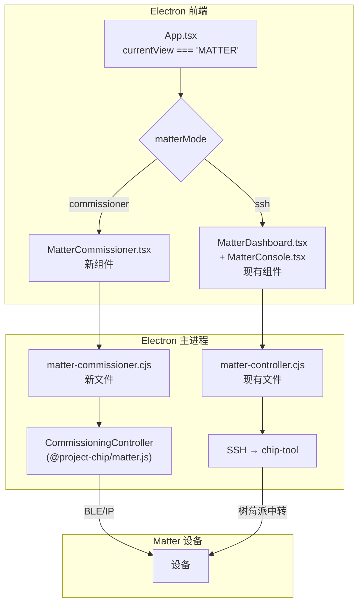
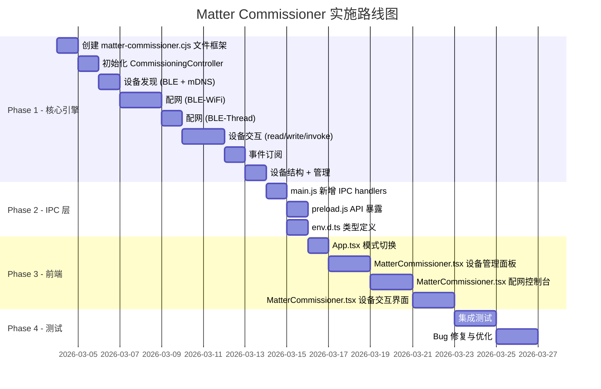

# Matter Commissioner 模块实施方案 v2.0

> **项目**: IoT Nexus Core  
> **日期**: 2026-03-03  
> **目标**: 在 Matter 板块新增 Commissioner 模式（直连设备），与现有 SSH 模式并存

## 实施进度追踪

| 阶段 | 内容 | 状态 | 备注 |
|------|------|------|------|
| Phase 1 | 核心引擎 `matter-commissioner.cjs` | ✅ 完成 | 15个导出函数，~900行 |
| Phase 2 | IPC 层 `main.js` + `preload.js` + `env.d.ts` | ✅ 完成 | 15个IPC handlers + 6个事件通道 |
| Phase 3 | 前端 `App.tsx` + `MatterCommissioner.tsx` | ✅ 完成 | 模式切换器 + 完整Commissioner UI |
| Phase 4 | 集成测试 | 🔄 进行中 | 依赖下方验证项 |

### 验证记录

- ✅ 所有依赖包 CJS require 正常（`@matter/main`, `@matter/nodejs`, `@matter/nodejs-ble`, `@project-chip/matter.js`）
- ✅ `CommissioningController` 初始化+关闭测试通过
- ✅ BLE 适配器检测正常（`bleAvailable: true`）
- ✅ 存储隔离机制正常
- ✅ Vite 构建通过
- ✅ 无 Commissioner 相关 TypeScript 错误

### API 修复记录（2026-03-03）

1. **`readAttribute`**: `getMultipleAttributes` 现改为 `getMultipleAttributes({ attributes: [...] })` 格式
2. **`writeAttribute`**: 改为通过 `PairedNode → ClusterClient → setAttribute()` 方式操作
3. **`invokeCommand`**: 改为通过 `PairedNode → ClusterClient → invoke()` 方式操作
4. **`stopDiscovery`**: 修正 `cancelCommissionableDeviceDiscovery` 参数为 `(identifierData, discoveryCapabilities)`
5. **Windows 防火墙 mDNS 规则** ⚠️ **关键修复**:
   - **问题**: Reconnect 阶段 mDNS 操作发现超时，BLE BTP 会话因 30s 空闲超时关闭
   - **原因**: Windows 防火墙默认阻止 Electron 进程的 UDP 5353 入站流量
   - **方案**: 添加防火墙规则允许 Electron 接收 UDP 5353 (mDNS) 和通用 UDP 入站
   - **补充**: `discoveryCapabilities` 中明确设置 `onIpNetwork: true`
   - **验证**: 配网成功！设备 Meross MRS105 通过 BLE-WiFi 配网，IP 连接到 `192.168.50.192:5540`
6. **`AES-128-CCM 兼容性补丁`** ⚠️ **关键修复**:
   - **问题**: Electron 31.x 使用 BoringSSL (而非 OpenSSL)，BoringSSL 不支持 `aes-128-ccm` 加密算法
   - **表现**: PASE 配对成功后，发送第一条加密消息时报 `ERR_CRYPTO_UNKNOWN_CIPHER`
   - **方案**: 在 `loadMatterModules()` 中检测 CCM 可用性，若不可用则 monkey-patch `NodeJsCrypto.prototype.encrypt/decrypt`
   - **实现**: 基于 RFC 3610 纯 JS 实现，使用 BoringSSL 支持的 `aes-128-ecb` 作为底层分组密码
   - **验证**: 7 项测试全部通过，包括与 Node.js 原生 CCM 的互操作性验证

### Reconnect 阶段行为说明

- Reconnect (Step 18) 中 BLE BTP 空闲计时器 30s 后关闭 BLE 连接是**预期行为**
- 同时 matter.js 的 `reArmFailsafeInterval` 每 30s 尝试通过 BLE 重新 arm failsafe
- BLE 关闭后该操作会报 `BTP session is not active` 错误，但 **不会导致配网失败**
- `transitionToCase()` 有 120s 超时通过 mDNS 发现设备并建立 CASE 会话
- 只要设备在 120s 内完成 WiFi 连接并开始 mDNS 操作广播，配网就会成功

---

## 一、方案概述

### 1.1 核心策略

在现有 Matter 页面的基础上，新增一个**模式选择入口**，让用户在两种方式之间切换：

| | Commissioner 模式（新） | SSH 模式（现有） |
|---|---|---|
| **原理** | Electron 主进程直接作为 Matter Commissioner | SSH → 树莓派 → chip-tool CLI |
| **配网** | matter.js `CommissioningController.commissionNode()` | chip-tool `pairing ble-wifi/ble-thread` |
| **通信** | `PairedNode` API + `InteractionClient` | SSH → chip-tool read/write/invoke |
| **设备发现** | BLE + mDNS 双模发现 | noble BLE 手动扫描 |
| **事件** | 实时订阅推送 | 无（轮询） |
| **依赖** | 本机 BLE 适配器 + 网络 | 树莓派 + SSH + chip-tool |
| **组件** | `MatterCommissioner.tsx`（新） | `MatterDashboard.tsx` + `MatterConsole.tsx`（保留） |

### 1.2 架构图



---

## 二、涉及文件清单

### 2.1 新增文件

| 文件 | 说明 |
|------|------|
| `matter-commissioner.cjs` | Commissioner 核心引擎，基于 matter.js `CommissioningController` |
| `components/MatterCommissioner.tsx` | Commissioner 模式的前端 UI 组件 |

### 2.2 修改文件

| 文件 | 修改内容 |
|------|---------|
| `App.tsx` | Matter 视图添加模式选择（commissioner / ssh），渲染对应组件 |
| `main.js` | 新增 Commissioner 相关的 IPC handlers |
| `preload.js` | 新增 Commissioner 相关的 API 暴露 |
| `env.d.ts` | 新增 Commissioner 相关的 TypeScript 类型定义 |

### 2.3 不修改的文件（完整保留）

| 文件 | 说明 |
|------|------|
| `matter-controller.cjs` | SSH 模式核心引擎，**不做任何修改** |
| `components/MatterConsole.tsx` | SSH 模式的扫描配网 UI，**不做任何修改** |
| `components/MatterDashboard.tsx` | SSH 模式的设备交互 UI，**不做任何修改** |

---

## 三、分阶段实施计划

### Phase 1：Commissioner 核心引擎（`matter-commissioner.cjs`）

#### 3.1.1 模块结构

```
matter-commissioner.cjs
├── initializeCommissioner()      — 创建 CommissioningController + BLE 环境
├── discoverDevices()             — BLE + mDNS 双模设备发现
├── stopDiscovery()               — 停止发现
├── commissionDevice()            — 配网（BLE-WiFi / BLE-Thread）
├── connectNode()                 — 连接已配网设备
├── disconnectNode()              — 断开设备连接
├── getCommissionedNodes()        — 获取所有已配网节点  
├── getNodeStructure()            — 读取设备完整结构（Endpoints/Clusters/Attributes）
├── readAttribute()               — 读取属性
├── writeAttribute()              — 写入属性
├── invokeCommand()               — 调用命令
├── subscribeNode()               — 订阅属性变化事件
├── removeNode()                  — 删除/解配设备  
├── shutdownCommissioner()        — 关闭 Commissioner
└── getStatus()                   — 获取 Commissioner 状态
```

#### 3.1.2 初始化实现

```javascript
const { Environment, StorageService, Logger } = require('@matter/main');
const { Ble } = require('@matter/main/protocol');
const { NodeJsBle } = require('@matter/nodejs-ble');
const { CommissioningController } = require('@project-chip/matter.js');
const { NodeId } = require('@matter/main/types');
const path = require('path');
const os = require('os');

// 存储路径（与 SSH 模式隔离，避免冲突）
const COMMISSIONER_STORAGE_PATH = path.join(os.homedir(), '.iot-nexus-core', 'commissioner-storage');

let commissioningController = null;
let environment = null;
let isInitialized = false;
let connectedNodes = new Map(); // nodeId -> PairedNode

async function initializeCommissioner(win) {
    if (isInitialized && commissioningController) {
        return { success: true, message: 'Already initialized' };
    }
    
    try {
        // 1. 创建 Matter Environment
        environment = Environment.default;
        
        // 2. 初始化 BLE 支持
        try {
            const { singleton } = require('@matter/main');
            Ble.get = singleton(() => new NodeJsBle({ environment }));
            console.log('[Commissioner] BLE initialized');
        } catch (bleErr) {
            console.warn('[Commissioner] BLE init failed:', bleErr.message);
            // BLE 不可用时仍然可以使用 IP 模式
        }
        
        // 3. 创建 CommissioningController
        const uniqueId = `iot-nexus-${Date.now()}`;
        commissioningController = new CommissioningController({
            environment: { environment, id: uniqueId },
            autoConnect: false,
            adminFabricLabel: 'IoT Nexus Commissioner',
        });
        
        // 4. 启动 Controller
        await commissioningController.start();
        
        isInitialized = true;
        console.log('[Commissioner] Initialized successfully');
        
        return { success: true, bleAvailable: true };
    } catch (error) {
        console.error('[Commissioner] Init failed:', error);
        return { success: false, error: error.message };
    }
}
```

#### 3.1.3 设备发现

```javascript
async function discoverDevices(win, options = {}) {
    if (!isInitialized) {
        return { success: false, error: 'Commissioner not initialized' };
    }
    
    const { discriminator, timeoutSeconds = 30 } = options;
    const discoveredDevices = [];
    
    try {
        const identifierData = discriminator != null
            ? { longDiscriminator: parseInt(discriminator) }
            : {};  // 空 = 发现所有可配网设备
        
        await commissioningController.discoverCommissionableDevices(
            identifierData,
            { ble: true },  // discoveryCapabilities：同时使用 BLE 和 IP
            (device) => {
                // 每发现一个设备，通知前端
                const deviceInfo = {
                    id: `${device.deviceIdentifier || Date.now()}`,
                    addresses: device.addresses || [],
                    port: device.port,
                    discriminator: device.longDiscriminator || device.shortDiscriminator,
                    vendorId: device.vendorId,
                    productId: device.productId,
                    commissioningMode: device.commissioningMode,
                    deviceName: device.deviceName || device.productName || 'Matter Device',
                    discoveredVia: device.discoveredVia,  // 'ble' 或 'mdns'
                };
                discoveredDevices.push(deviceInfo);
                
                if (win && !win.isDestroyed()) {
                    win.webContents.send('commissioner:device-discovered', deviceInfo);
                }
            },
            timeoutSeconds
        );
        
        return { success: true, devices: discoveredDevices };
    } catch (error) {
        console.error('[Commissioner] Discovery error:', error);
        return { success: false, error: error.message, devices: discoveredDevices };
    }
}
```

#### 3.1.4 配网（BLE-WiFi / BLE-Thread）

```javascript
const { GeneralCommissioning } = require('@matter/main/clusters');

async function commissionDevice(win, params) {
    if (!isInitialized) {
        return { success: false, error: 'Commissioner not initialized' };
    }
    
    const { passcode, discriminator, pairingMode, wifiSsid, wifiPassword, threadDataset } = params;
    
    const sendProgress = (stage, message) => {
        console.log(`[Commissioner] [${stage}] ${message}`);
        if (win && !win.isDestroyed()) {
            win.webContents.send('commissioner:commissioning-progress', { stage, message });
        }
    };
    
    try {
        // 1. 构建配网选项
        const commissioningOptions = {
            regulatoryLocation: GeneralCommissioning.RegulatoryLocationType.IndoorOutdoor,
            regulatoryCountryCode: 'XX',
        };
        
        // 2. 根据配网模式配置网络凭证
        if (pairingMode === 'ble-wifi') {
            if (!wifiSsid || !wifiPassword) {
                return { success: false, error: 'WiFi SSID and password are required for BLE-WiFi commissioning' };
            }
            commissioningOptions.wifiNetwork = {
                wifiSsid: wifiSsid,
                wifiCredentials: wifiPassword,
            };
            sendProgress('config', `Configuring BLE-WiFi: ${wifiSsid}`);
        } else if (pairingMode === 'ble-thread') {
            if (!threadDataset) {
                return { success: false, error: 'Thread operational dataset is required for BLE-Thread commissioning' };
            }
            commissioningOptions.threadNetwork = {
                networkName: 'Thread',
                operationalDataset: threadDataset,
            };
            sendProgress('config', 'Configuring BLE-Thread');
        }
        
        // 3. 构建发现选项
        const nodeOptions = {
            commissioning: commissioningOptions,
            discovery: {
                identifierData: discriminator != null
                    ? { longDiscriminator: parseInt(discriminator) }
                    : {},
                discoveryCapabilities: { ble: true },
            },
            passcode: parseInt(passcode),
        };
        
        sendProgress('commissioning', 'Starting commissioning...');
        
        // 4. 执行配网（matter.js 内部自动完成完整流程）
        //    PASE → 证书交换 → 网络配置 → CASE → 完成
        const nodeId = await commissioningController.commissionNode(nodeOptions);
        
        sendProgress('complete', `Commissioning successful! Node ID: ${nodeId}`);
        
        return { 
            success: true, 
            nodeId: nodeId.toString(),
            message: `Device commissioned with Node ID: ${nodeId}`
        };
    } catch (error) {
        console.error('[Commissioner] Commissioning failed:', error);
        sendProgress('error', error.message);
        return { success: false, error: error.message };
    }
}
```

#### 3.1.5 设备交互（连接、读/写属性、调用命令）

```javascript
const { DescriptorCluster, BasicInformationCluster, OnOff } = require('@matter/main/clusters');

async function connectNode(nodeId) {
    if (!isInitialized) {
        return { success: false, error: 'Commissioner not initialized' };
    }
    
    try {
        const node = await commissioningController.getNode(NodeId(parseInt(nodeId)));
        
        if (!node.isConnected) {
            node.connect();
        }
        
        // 等待初始化完成
        if (!node.initialized) {
            await node.events.initialized;
        }
        
        connectedNodes.set(nodeId.toString(), node);
        
        return { success: true, nodeId: nodeId.toString() };
    } catch (error) {
        return { success: false, error: error.message };
    }
}

async function getNodeStructure(nodeId) {
    try {
        const node = connectedNodes.get(nodeId.toString()) 
            || await commissioningController.getNode(NodeId(parseInt(nodeId)));
        
        if (!node.isConnected) {
            node.connect();
            if (!node.initialized) await node.events.initialized;
        }
        
        const devices = node.getDevices();
        
        // 基本信息
        const basicInfo = node.getRootClusterClient(BasicInformationCluster);
        let deviceInfo = {};
        if (basicInfo) {
            try {
                deviceInfo = {
                    vendorName: await basicInfo.getVendorNameAttribute(),
                    vendorId: await basicInfo.getVendorIdAttribute(),
                    productName: await basicInfo.getProductNameAttribute(),
                    nodeLabel: await basicInfo.getNodeLabelAttribute?.(),
                    softwareVersion: await basicInfo.getSoftwareVersionStringAttribute?.(),
                };
            } catch (e) {
                console.warn('[Commissioner] Failed to read basic info:', e.message);
            }
        }
        
        // 设备端点结构
        const endpoints = [];
        for (const device of devices) {
            const endpoint = {
                id: device.number,
                deviceTypes: [], // device type list
                clusters: [],
            };
            
            // 获取该 endpoint 上的所有 Cluster Clients
            const clusterClients = device.getClusterClients?.() || [];
            for (const cluster of clusterClients) {
                endpoint.clusters.push({
                    id: cluster.id,
                    name: cluster.name,
                    // 属性和命令定义来自 matter.js 内置 Model
                });
            }
            
            endpoints.push(endpoint);
        }
        
        return { success: true, deviceInfo, endpoints };
    } catch (error) {
        return { success: false, error: error.message };
    }
}

async function readAttribute(nodeId, endpointId, clusterId, attributeId) {
    try {
        const interactionClient = await commissioningController.createInteractionClient(
            NodeId(parseInt(nodeId))
        );
        
        const result = await interactionClient.getMultipleAttributes([{
            endpointId, clusterId, attributeId
        }]);
        
        if (result.length > 0) {
            return { success: true, value: result[0].value, path: result[0].path };
        }
        return { success: false, error: 'No data returned' };
    } catch (error) {
        return { success: false, error: error.message };
    }
}

async function writeAttribute(nodeId, endpointId, clusterId, attributeId, value) {
    try {
        const interactionClient = await commissioningController.createInteractionClient(
            NodeId(parseInt(nodeId))
        );
        
        await interactionClient.setMultipleAttributes({
            attributes: [{ endpointId, clusterId, attributeId, value }]
        });
        
        return { success: true };
    } catch (error) {
        return { success: false, error: error.message };
    }
}

async function invokeCommand(nodeId, endpointId, clusterId, commandId, commandFields = {}) {
    try {
        const interactionClient = await commissioningController.createInteractionClient(
            NodeId(parseInt(nodeId))
        );
        
        const result = await interactionClient.invoke(
            endpointId, clusterId, commandId, commandFields
        );
        
        return { success: true, result };
    } catch (error) {
        return { success: false, error: error.message };
    }
}
```

#### 3.1.6 事件订阅

```javascript
async function subscribeNode(nodeId, win) {
    try {
        const node = connectedNodes.get(nodeId.toString())
            || await commissioningController.getNode(NodeId(parseInt(nodeId)));
        
        // 设备状态变化
        node.events.stateChanged.on(state => {
            if (win && !win.isDestroyed()) {
                win.webContents.send('commissioner:node-state-changed', {
                    nodeId, state: state.toString()
                });
            }
        });
        
        // 属性变化
        node.events.attributeChanged.on(({ path, value }) => {
            if (win && !win.isDestroyed()) {
                win.webContents.send('commissioner:attribute-changed', {
                    nodeId,
                    endpointId: path.endpointId,
                    clusterId: path.clusterId,
                    attributeName: path.attributeName,
                    value
                });
            }
        });
        
        // 事件触发
        node.events.eventTriggered.on(({ path, events }) => {
            if (win && !win.isDestroyed()) {
                win.webContents.send('commissioner:event-triggered', {
                    nodeId,
                    endpointId: path.endpointId,
                    clusterId: path.clusterId,
                    eventName: path.eventName,
                    events
                });
            }
        });
        
        return { success: true };
    } catch (error) {
        return { success: false, error: error.message };
    }
}
```

#### 3.1.7 设备管理

```javascript
async function getCommissionedNodes() {
    if (!isInitialized) return { success: false, error: 'Not initialized' };
    
    try {
        const nodeIds = commissioningController.getCommissionedNodes();
        const details = commissioningController.getCommissionedNodesDetails();
        
        const nodes = details.map(detail => ({
            nodeId: detail.nodeId.toString(),
            ...detail,
        }));
        
        return { success: true, nodes };
    } catch (error) {
        return { success: false, error: error.message, nodes: [] };
    }
}

async function removeNode(nodeId) {
    try {
        await commissioningController.removeNode(NodeId(parseInt(nodeId)));
        connectedNodes.delete(nodeId.toString());
        return { success: true };
    } catch (error) {
        return { success: false, error: error.message };
    }
}

async function shutdownCommissioner() {
    try {
        if (commissioningController) {
            await commissioningController.close();
        }
        commissioningController = null;
        isInitialized = false;
        connectedNodes.clear();
        return { success: true };
    } catch (error) {
        return { success: false, error: error.message };
    }
}

function getStatus() {
    return {
        initialized: isInitialized,
        connectedNodes: Array.from(connectedNodes.keys()),
        commissionedNodes: isInitialized 
            ? commissioningController?.getCommissionedNodes()?.map(n => n.toString()) || []
            : [],
    };
}
```

---

### Phase 2：IPC 层（`main.js` + `preload.js`）

#### 3.2.1 main.js 新增 IPC Handlers

在现有的 `// ========== MATTER PROTOCOL ==========` 区块**之后**，新增独立的 Commissioner 区块：

```javascript
// ========== MATTER COMMISSIONER (Direct Connection) ==========

let matterCommissioner = null;

async function getMatterCommissioner() {
    if (!matterCommissioner) {
        // 使用 dynamic import，因为 matter-commissioner.cjs 可能是 ESM
        matterCommissioner = await import('./matter-commissioner.cjs');
    }
    return matterCommissioner;
}

ipcMain.handle('commissioner:init', async () => {
    const commissioner = await getMatterCommissioner();
    return commissioner.initializeCommissioner(win);
});

ipcMain.handle('commissioner:discover', async (event, options) => {
    const commissioner = await getMatterCommissioner();
    return commissioner.discoverDevices(win, options);
});

ipcMain.handle('commissioner:stopDiscovery', async () => {
    const commissioner = await getMatterCommissioner();
    return commissioner.stopDiscovery();
});

ipcMain.handle('commissioner:commission', async (event, params) => {
    const commissioner = await getMatterCommissioner();
    return commissioner.commissionDevice(win, params);
});

ipcMain.handle('commissioner:connectNode', async (event, { nodeId }) => {
    const commissioner = await getMatterCommissioner();
    return commissioner.connectNode(nodeId);
});

ipcMain.handle('commissioner:disconnectNode', async (event, { nodeId }) => {
    const commissioner = await getMatterCommissioner();
    return commissioner.disconnectNode(nodeId);
});

ipcMain.handle('commissioner:getNodes', async () => {
    const commissioner = await getMatterCommissioner();
    return commissioner.getCommissionedNodes();
});

ipcMain.handle('commissioner:getNodeStructure', async (event, { nodeId }) => {
    const commissioner = await getMatterCommissioner();
    return commissioner.getNodeStructure(nodeId);
});

ipcMain.handle('commissioner:readAttribute', async (event, args) => {
    const commissioner = await getMatterCommissioner();
    return commissioner.readAttribute(args.nodeId, args.endpointId, args.clusterId, args.attributeId);
});

ipcMain.handle('commissioner:writeAttribute', async (event, args) => {
    const commissioner = await getMatterCommissioner();
    return commissioner.writeAttribute(args.nodeId, args.endpointId, args.clusterId, args.attributeId, args.value);
});

ipcMain.handle('commissioner:invokeCommand', async (event, args) => {
    const commissioner = await getMatterCommissioner();
    return commissioner.invokeCommand(args.nodeId, args.endpointId, args.clusterId, args.commandId, args.args);
});

ipcMain.handle('commissioner:subscribeNode', async (event, { nodeId }) => {
    const commissioner = await getMatterCommissioner();
    return commissioner.subscribeNode(nodeId, win);
});

ipcMain.handle('commissioner:removeNode', async (event, { nodeId }) => {
    const commissioner = await getMatterCommissioner();
    return commissioner.removeNode(nodeId);
});

ipcMain.handle('commissioner:status', async () => {
    const commissioner = await getMatterCommissioner();
    return commissioner.getStatus();
});

ipcMain.handle('commissioner:shutdown', async () => {
    const commissioner = await getMatterCommissioner();
    return commissioner.shutdownCommissioner();
});
```

#### 3.2.2 preload.js 新增暴露

在现有 Matter IPC 接口**之后**新增：

```javascript
// ===== COMMISSIONER IPC 接口 (Direct Connection) =====
commissionerInit: () => ipcRenderer.invoke('commissioner:init'),
commissionerDiscover: (options) => ipcRenderer.invoke('commissioner:discover', options),
commissionerStopDiscovery: () => ipcRenderer.invoke('commissioner:stopDiscovery'),
commissionerCommission: (params) => ipcRenderer.invoke('commissioner:commission', params),
commissionerConnectNode: (nodeId) => ipcRenderer.invoke('commissioner:connectNode', { nodeId }),
commissionerDisconnectNode: (nodeId) => ipcRenderer.invoke('commissioner:disconnectNode', { nodeId }),
commissionerGetNodes: () => ipcRenderer.invoke('commissioner:getNodes'),
commissionerGetNodeStructure: (nodeId) => ipcRenderer.invoke('commissioner:getNodeStructure', { nodeId }),
commissionerReadAttribute: (args) => ipcRenderer.invoke('commissioner:readAttribute', args),
commissionerWriteAttribute: (args) => ipcRenderer.invoke('commissioner:writeAttribute', args),
commissionerInvokeCommand: (args) => ipcRenderer.invoke('commissioner:invokeCommand', args),
commissionerSubscribeNode: (nodeId) => ipcRenderer.invoke('commissioner:subscribeNode', { nodeId }),
commissionerRemoveNode: (nodeId) => ipcRenderer.invoke('commissioner:removeNode', { nodeId }),
commissionerStatus: () => ipcRenderer.invoke('commissioner:status'),
commissionerShutdown: () => ipcRenderer.invoke('commissioner:shutdown'),

// Commissioner 事件监听
onCommissionerDeviceDiscovered: (callback) => {
    ipcRenderer.on('commissioner:device-discovered', (event, data) => callback(data));
},
onCommissionerCommissioningProgress: (callback) => {
    ipcRenderer.on('commissioner:commissioning-progress', (event, data) => callback(data));
},
onCommissionerNodeStateChanged: (callback) => {
    ipcRenderer.on('commissioner:node-state-changed', (event, data) => callback(data));
},
onCommissionerAttributeChanged: (callback) => {
    ipcRenderer.on('commissioner:attribute-changed', (event, data) => callback(data));
},
onCommissionerEventTriggered: (callback) => {
    ipcRenderer.on('commissioner:event-triggered', (event, data) => callback(data));
},
```

#### 3.2.3 env.d.ts 新增类型

在现有 Matter 类型后追加：

```typescript
// ===== Commissioner (Direct Connection) =====
commissionerInit: () => Promise<{ success: boolean; bleAvailable?: boolean; error?: string }>;
commissionerDiscover: (options?: { discriminator?: number; timeoutSeconds?: number }) => Promise<{
    success: boolean;
    devices?: CommissionerDiscoveredDevice[];
    error?: string;
}>;
commissionerStopDiscovery: () => Promise<{ success: boolean }>;
commissionerCommission: (params: {
    passcode: string;
    discriminator?: number;
    pairingMode: 'ble-wifi' | 'ble-thread';
    wifiSsid?: string;
    wifiPassword?: string;
    threadDataset?: string;
}) => Promise<{ success: boolean; nodeId?: string; error?: string }>;
commissionerConnectNode: (nodeId: string) => Promise<{ success: boolean; error?: string }>;
commissionerDisconnectNode: (nodeId: string) => Promise<{ success: boolean; error?: string }>;
commissionerGetNodes: () => Promise<{
    success: boolean;
    nodes?: CommissionerNode[];
    error?: string;
}>;
commissionerGetNodeStructure: (nodeId: string) => Promise<{
    success: boolean;
    deviceInfo?: Record<string, any>;
    endpoints?: CommissionerEndpoint[];
    error?: string;
}>;
commissionerReadAttribute: (args: {
    nodeId: string; endpointId: number; clusterId: number; attributeId: number;
}) => Promise<{ success: boolean; value?: any; error?: string }>;
commissionerWriteAttribute: (args: {
    nodeId: string; endpointId: number; clusterId: number; attributeId: number; value: any;
}) => Promise<{ success: boolean; error?: string }>;
commissionerInvokeCommand: (args: {
    nodeId: string; endpointId: number; clusterId: number; commandId: number; args?: any;
}) => Promise<{ success: boolean; result?: any; error?: string }>;
commissionerSubscribeNode: (nodeId: string) => Promise<{ success: boolean; error?: string }>;
commissionerRemoveNode: (nodeId: string) => Promise<{ success: boolean; error?: string }>;
commissionerStatus: () => Promise<{
    initialized: boolean;
    connectedNodes: string[];
    commissionedNodes: string[];
}>;
commissionerShutdown: () => Promise<{ success: boolean }>;

// Commissioner 事件监听
onCommissionerDeviceDiscovered: (callback: (device: CommissionerDiscoveredDevice) => void) => void;
onCommissionerCommissioningProgress: (callback: (data: { stage: string; message: string }) => void) => void;
onCommissionerNodeStateChanged: (callback: (data: { nodeId: string; state: string }) => void) => void;
onCommissionerAttributeChanged: (callback: (data: { nodeId: string; endpointId: number; clusterId: number; attributeName: string; value: any }) => void) => void;
onCommissionerEventTriggered: (callback: (data: { nodeId: string; endpointId: number; clusterId: number; eventName: string; events: any }) => void) => void;

// --- Commissioner 类型定义 ---
interface CommissionerDiscoveredDevice {
    id: string;
    deviceName: string;
    discriminator?: number;
    vendorId?: number;
    productId?: number;
    commissioningMode?: number;
    addresses: string[];
    port?: number;
    discoveredVia?: string;
}

interface CommissionerNode {
    nodeId: string;
    // CommissioningController 返回的元数据
    [key: string]: any;
}

interface CommissionerEndpoint {
    id: number;
    deviceTypes: number[];
    clusters: CommissionerCluster[];
}

interface CommissionerCluster {
    id: number;
    name: string;
}
```

---

### Phase 3：前端组件

#### 3.3.1 App.tsx 修改

**现有代码**（行 1337-1343）：
```tsx
{currentView === 'MATTER' && (
    <div className="space-y-6">
        <MatterDashboard onLog={recordGlobalLog} />
        <MatterConsole onLog={recordGlobalLog} />
    </div>
)}
```

**修改为**：
```tsx
{currentView === 'MATTER' && (
    <div className="space-y-6">
        {/* Matter 模式选择器 */}
        <div className="flex items-center gap-4 mb-4">
            <div className="flex bg-slate-800 rounded-2xl p-1">
                <button
                    onClick={() => setMatterMode('commissioner')}
                    className={`px-6 py-2 rounded-xl text-xs font-bold uppercase tracking-wider transition-all ${
                        matterMode === 'commissioner' 
                        ? 'bg-indigo-600 text-white shadow-lg' 
                        : 'text-slate-400 hover:text-white'
                    }`}
                >
                    ⚡ Commissioner (Direct)
                </button>
                <button
                    onClick={() => setMatterMode('ssh')}
                    className={`px-6 py-2 rounded-xl text-xs font-bold uppercase tracking-wider transition-all ${
                        matterMode === 'ssh' 
                        ? 'bg-emerald-600 text-white shadow-lg' 
                        : 'text-slate-400 hover:text-white'
                    }`}
                >
                    🖥 SSH (Remote chip-tool)
                </button>
            </div>
            <span className="text-slate-600 text-xs">
                {matterMode === 'commissioner' 
                    ? 'Direct BLE/IP connection to Matter devices' 
                    : 'Via SSH to Raspberry Pi running chip-tool'}
            </span>
        </div>
        
        {/* 根据模式渲染不同组件 */}
        {matterMode === 'commissioner' ? (
            <MatterCommissioner onLog={recordGlobalLog} />
        ) : (
            <>
                <MatterDashboard onLog={recordGlobalLog} />
                <MatterConsole onLog={recordGlobalLog} />
            </>
        )}
    </div>
)}
```

需要在 App 组件中新增状态：
```tsx
const [matterMode, setMatterMode] = useState<'commissioner' | 'ssh'>('commissioner');
```

和 import：
```tsx
import { MatterCommissioner } from './components/MatterCommissioner';
```

#### 3.3.2 MatterCommissioner.tsx 组件结构

这个新组件将包含完整的 Commissioner 模式 UI，分为以下区域：

```
┌─────────────────────────────────────────────────────┐
│ ✦ MATTER COMMISSIONER              [Status: Ready]  │
│ ┌───────────────────────┐  ┌──────────────────────┐  │
│ │ COMMISSIONED DEVICES  │  │ DEVICE DETAIL        │  │
│ │                       │  │                      │  │
│ │ • Node 12345 (Online) │  │ Basic Info:          │  │
│ │ • Node 67890 (Offline)│  │   VendorName: xxx    │  │
│ │                       │  │   ProductName: xxx   │  │
│ │ [+ Commission New]    │  │                      │  │
│ │ [🔄 Refresh]          │  │ Endpoints:           │  │
│ │                       │  │   EP 0: Root         │  │
│ │                       │  │   EP 1: On/Off Light │  │
│ │                       │  │     - OnOff: true    │  │
│ │                       │  │     [Toggle] [On]    │  │
│ └───────────────────────┘  └──────────────────────┘  │
├─────────────────────────────────────────────────────┤
│ ✦ COMMISSIONING CONSOLE                             │
│ ┌─────────────────────────────────────────────────┐  │
│ │ [Initialize]  [Scan 30s]  [Stop]                │  │
│ │                                                  │  │
│ │ Discriminator Filter: [____]                     │  │
│ │ Pairing Mode: [BLE-WiFi ▼]                      │  │
│ │ WiFi SSID: [________]  Password: [________]     │  │
│ │ OR                                               │  │
│ │ Thread Dataset: [________________________________]│  │
│ │                                                  │  │
│ │ Discovered Devices:                              │  │
│ │ ┌──────────────────────────────────────────────┐ │  │
│ │ │ Matter Device (disc: 3840, via: BLE)    [✦]  │ │  │
│ │ │ Matter Bulb (disc: 1234, via: mDNS)     [✦]  │ │  │
│ │ └──────────────────────────────────────────────┘ │  │
│ │                                                  │  │
│ │ Commission: Passcode [________]  [Start]         │  │
│ │                                                  │  │
│ │ Progress Log:                                     │  │
│ │ [config] Configuring BLE-WiFi: MyWiFi            │  │
│ │ [commissioning] Starting commissioning...         │  │
│ │ [complete] ✓ Node ID: 12345                      │  │
│ └─────────────────────────────────────────────────┘  │
└─────────────────────────────────────────────────────┘
```

功能模块：
1. **设备管理面板**（上半部分）
   - 已配网设备列表（左侧）
   - 设备详情（右侧）：基本信息、端点结构、属性值、命令按钮
   - 实时属性更新（事件订阅驱动）
   
2. **配网控制台**（下半部分）
   - Initialize / Scan / Stop 按钮
   - Discriminator 过滤
   - 配网模式选择（BLE-WiFi / BLE-Thread）
   - WiFi 凭证输入 或 Thread Dataset 输入
   - 已发现设备列表
   - Passcode 输入 + 开始配网
   - 配网进度日志

---

### Phase 4：集成测试与优化

#### 3.4.1 功能验证清单

| # | 测试项 | 验收标准 |
|---|--------|---------|
| 1 | Commissioner 初始化 | BLE 可用，Controller 启动成功 |
| 2 | BLE 设备发现 | 能扫描到处于配网模式的 Matter 设备 |
| 3 | mDNS 设备发现 | 能发现已在网络上的可配网设备 |
| 4 | BLE-WiFi 配网 | 输入 WiFi 凭证后完成全流程配网 |
| 5 | BLE-Thread 配网 | 输入 Thread Dataset 后完成全流程配网 |
| 6 | 设备结构读取 | 能获取完整的 Endpoint/Cluster 结构 |
| 7 | 属性读取 | 能读取 OnOff、BasicInfo 等属性 |
| 8 | 属性写入 | 能写入可写属性 |
| 9 | 命令调用 | 能调用 Toggle、MoveToLevel 等命令 |
| 10 | 事件订阅 | 属性变化时 UI 实时更新 |
| 11 | 设备持久化 | 重启应用后已配网设备仍存在 |
| 12 | 设备删除 | 能从 Fabric 中移除设备 |
| 13 | 模式切换 | Commissioner ↔ SSH 切换不影响各自状态 |
| 14 | SSH 模式完整性 | SSH 模式所有功能不受影响 |

---

## 四、技术风险及应对措施

| # | 风险 | 影响 | 应对方案 |
|---|------|------|---------|
| 1 | **Windows BLE 兼容** | `@stoprocent/noble` 在 Windows 上可能有驱动问题 | 项目已使用此 fork (v2.3.10)，对 Windows 支持较好。若仍有问题，增加详细错误提示引导用户安装 WinUSB 驱动 |
| 2 | **CJS/ESM 混用** | `matter-controller.cjs` 是 CJS，`@matter/main` 是 ESM | Commissioner 新文件可以用 `.mjs` 或 ESM 格式，通过 `import()` 动态导入加载。main.js 已有此模式的先例 |
| 3 | **BLE 扫描与 noble 冲突** | 旧的 `matter-controller.cjs` 也使用 noble 扫描，两者可能冲突 | Commissioner 模式下使用 matter.js 的 `NodeJsBle`（内部也基于 noble），两者不应同时使用。通过模式切换保证隔离 |
| 4 | **配网超时** | BLE 配网流程较长（30-120秒），可能超时 | matter.js 内部有超时管理。在 UI 上显示详细进度，支持用户取消 |
| 5 | **Fabric 存储冲突** | Commissioner 和 SSH 模式使用不同 Fabric，设备不互通 | 使用隔离的存储路径。在 UI 上明确标注「Commissioner 设备」和「SSH 设备」为独立设备列表 |

---

## 五、实施路线图



### 预估工期

| Phase | 内容 | 工期 |
|-------|------|------|
| Phase 1 | Commissioner 核心引擎 | ~10 个工作日 |
| Phase 2 | IPC 层适配 | ~2 个工作日 |
| Phase 3 | 前端组件 | ~7 个工作日 |
| Phase 4 | 测试与优化 | ~4 个工作日 |
| **总计** | | **~23 个工作日** |

> [!TIP]
> Phase 1-2 完成后即可进行初步联调。Phase 3 可以边做边测，逐步完善 UI。

---

## 六、交付物

每个 Phase 完成后交付：

| Phase | 交付物 |
|-------|--------|
| Phase 1 | `matter-commissioner.cjs` 完整文件，含所有核心函数 |
| Phase 2 | `main.js` + `preload.js` + `env.d.ts` 的修改 |
| Phase 3 | `components/MatterCommissioner.tsx` + `App.tsx` 的修改 |
| Phase 4 | 测试通过的完整功能，Bug 修复记录 |

---

## 七、关键设计决策总结

1. **新旧并存**：Commissioner 模式和 SSH 模式完全隔离，通过 UI 上的模式选择器切换，互不影响
2. **IPC 命名空间隔离**：Commissioner 使用 `commissioner:*` 前缀，SSH 使用 `matter:*` 前缀
3. **存储隔离**：Commissioner 使用 `~/.iot-nexus-core/commissioner-storage/`，SSH 使用 `~/.iot-nexus-core/matter-storage/`
4. **独立文件**：新建 `matter-commissioner.cjs` 而非修改 `matter-controller.cjs`，保证 SSH 模式零影响
5. **BLE 复用**：两种模式不应同时使用 BLE（noble 是单例），通过模式切换保证互斥

如果方案确认，我将从 **Phase 1** 开始实施。
